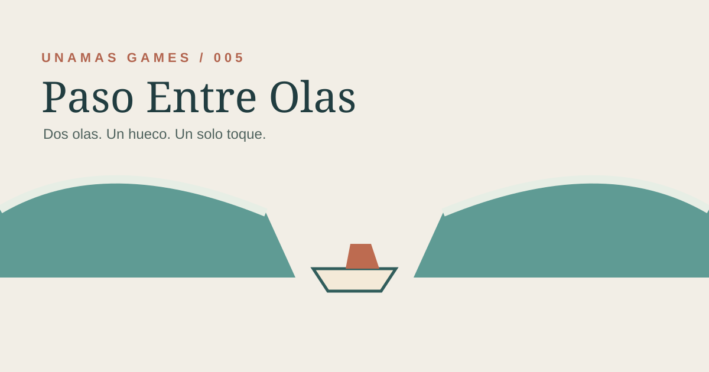

# ⚓ El Amarre Perfecto

### Corta el motor. Y espera.

**¿Puedes dejar la barca prácticamente clavada junto al amarre?**

`🎮 Juego gratuito` · `📱 Móvil y escritorio` · `👆 Un solo toque`

---

## ⚓ Corta en el momento justo

La barca avanza automáticamente hacia el amarre. Tu única decisión es **cuándo cortar el motor**. Desde ese instante no puedes corregir nada: observa cómo pierde velocidad y espera a descubrir dónde se detiene.

**🚤 AVANZA → 👆 CORTA → 😬 ESPERA → ⚓ RESULTADO → UNA MÁS**

| Detalle | Cómo funciona |
| :--- | :--- |
| 🚤 Barca | Entra con una velocidad ligeramente diferente en cada intento. |
| 👆 Control | Un toque, clic o barra espaciadora para cortar el motor. |
| 🌊 Inercia | Tras cortar, la barca sigue deslizándose hasta detenerse. |
| ⚓ Objetivo | Quedar lo más cerca posible del punto de amarre. |
| ⭐ Récord | Se guarda tu menor distancia al amarre. |
| 🔊 Sonido | Empieza desactivado. |

## 🚀 Jugar

**[Abrir El Amarre Perfecto](https://goyoaga.github.io/el-amarre-perfecto/)**

Cada intento dura solo unos segundos. Lo difícil empieza después de tocar: ya no puedes hacer nada salvo mirar cómo la barca se acerca… y esperar.

## ☕ Apoya UNAMAS GAMES

Si te divertiste, puedes **[invitarme un café en Ko-fi ☕](https://ko-fi.com/arielgoyoaga)**.

Descubre los demás juegos en **[UNAMAS GAMES](https://goyoaga.github.io/unamas-games/)**.

---

Una más. Y otra. ⚓

